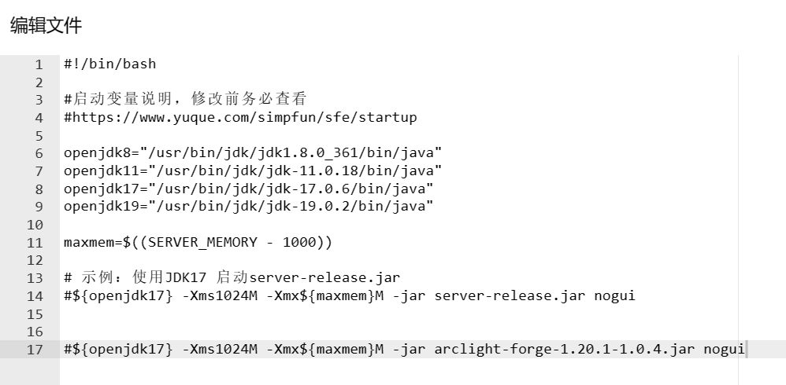

:::warning 提示

由于混合端的特性，一般情况下不建议使用混合端。

:::

这部分内容使用**Arclight 1.20.1**进行演示。

### 第一步：下载服务端

混合端核心下载地址：

+ CatServer
  + Github：[https://github.com/Luohuayu/CatServer/releases](https://github.com/Luohuayu/CatServer/releases)
  + 无极镜像(CN)：[https://www.fastmirror.net/#/download/CatServer](https://www.fastmirror.net/#/download/CatServe)
+ Arclight
  + Github：[https://github.com/IzzelAliz/Arclight/releases](https://github.com/IzzelAliz/Arclight/releases)
  + 无极镜像(CN)：[https://www.fastmirror.net/#/download/Arclight](https://www.fastmirror.net/#/download/Arclight)
+ Mohist
  + 官方：[https://new.mohistmc.com/downloadSoftware?project=mohist](https://new.mohistmc.com/downloadSoftware?project=mohist)
  + 无极镜像(CN)：[https://www.fastmirror.net/#/download/Mohist](https://www.fastmirror.net/#/download/Mohist)

下载完成后将其上传至实例的根目录。

确定服务端核心已上传后，**记住文件名（包括后缀名!）**。

打开根目录下的 `start.sh` (在Windows镜像下为`start.cmd`)，添加一行类似下面的命令后保存(不要删除文件里原本的东西，除了最下面那行echo)：

```sh
${openjdk17} -server -Xms1024M -Xmx${maxmem}M -jar arclight-forge-1.20.1-1.0.4.jar -nogui
```

:::info

关于各项参数的说明：

`{openjdk17}`：调用变量`openjdk17`。这个变量在上面的默认内容里被定义过了。1.16.5及以下版本的服务端请将`openjdk17`改为`openjdk8`或`openjdk11`。

`-server`：用于指示 JVM（Java虚拟机）在服务器环境中运行。这个参数实际上是一个优化标记，它告诉JVM使用更适合长时间运行和高性能的配置。

`-Xms1024M`：服务器运行最小内存为1024Mib。你可以更改`1024M`这个值：如果觉得最小运存太大可以改为`512M`或其他值，只要数字部分是4的倍数；如果强迫症不想使用M作为单位，可以改为`1G`，效果同样。

`Xmx${maxmem}M`：服务器运行最大内存为maxmxm M。maxmxm是上文定义的变量，为服务器最大物理内存-1000（单位M）。如果不想要这个~~烦人的~~变量名可以把`${maxmem}`整个改成数字，让它变得和`Xmx`这一项看起来一样。**注：`Xmx`与`Xms`均不要设为超出实例运行内存上限的值，也不要设反了让最大值比最小值小，会导致服务器无法启动！**

`-jar`：告诉Java你要启动jar文件。此项不要调整。

`arclight-forge-1.20.1-1.0.4.jar`：服务端核心名称，**改成自己上传的，包括刚才让你记的后缀名！！**

`-nogui`：不启用MC服务端自带的一个GUI窗口，**部分混合端不要加上此参数，会导致无法启动服务器**！

:::

调整完的启动命令应类似下图所示：


### 第二步：下载依赖文件

回到`终端`界面，启动实例，等待服务端构建完成后会出现以下输出并停止运行。

```txt
[16:35:25 WARN]: Failed to load eula.txt
[16:35:25 INFO]: You need to agree to the EULA in order to run the server. Go to eula.txt for more info.
```

:::info 提示

Arclight端在构建完成后会自动启动一次到同意EULA的步骤。

CatServer端的部分版本会自动帮你同意EULA。

:::

### 第三步：同意 EULA

转到`文件`页面，打开根目录下的`eula.txt`。

```ini
#By changing the setting below to TRUE you are indicating your agreement to our EULA (https://aka.ms/MinecraftEULA).
#Sat Feb 03 16:35:25 CST 2024
eula=false
```

将其中的`false`改为`true`。

:::warning 提示

将eula中的`false`改为`true`即视为你已阅读并同意[《MINECRAFT 最终用户许可协议(EULA)》](https://www.minecraft.net/zh-hans/eula)!

:::

回到`终端`界面，点击右上角的`启动`，等待服务器生成文件。
看到类似以下的提示即可关闭服务端：

```txt
[16:43:52] [INFO]: Done (23.320s)! For help, type "help"
```

### 第四步: 根据需要进行配置

再次进入`文件`页面，打开根目录下的`server.properties`。  

简幻欢在上一步启动服务端生成文件时已自动修改`server-ip`为`0.0.0.0`，`server-port`为你实例分配到的端口号，因此可以不用管这两个。  

如果你或者你的朋友没有正版账户，请把`online-mode`的值由`true`改为`false`。  

**更多关于服务器设置的配置请查看[这篇文档](../mcje/20-serverproperties.md)。**

Mod文件放入`/mods`文件夹。

插件本体放到`/plugins`文件夹。

需要更换存档请参考[这篇文档](../mcje/25-Upload-worlds.md)。

现在你已经配置好服务端了，去愉快地玩游戏吧！
