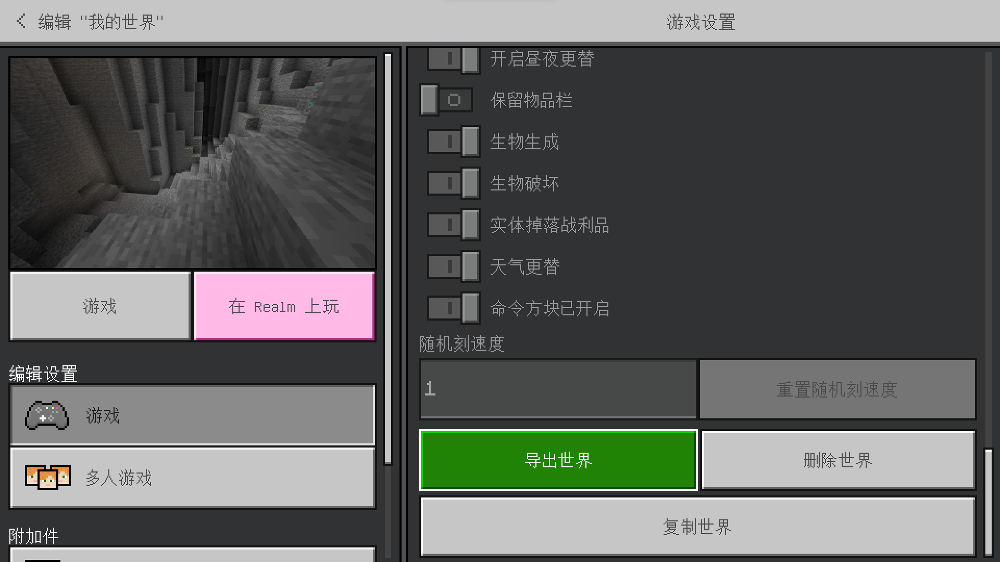
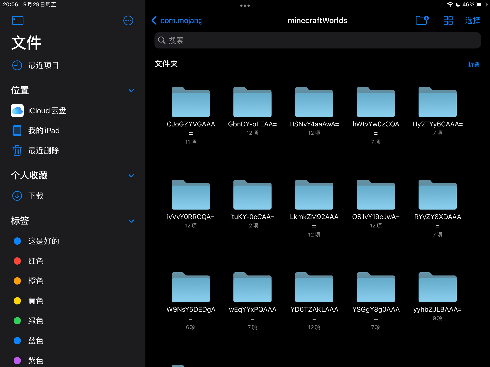
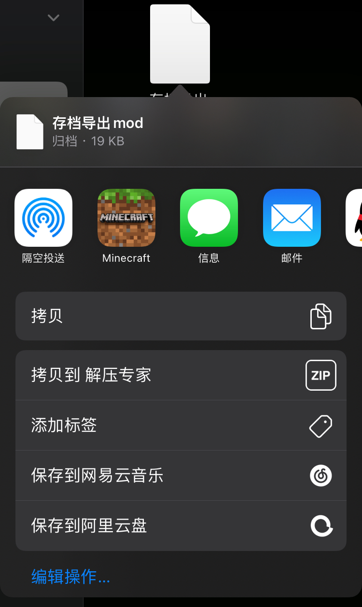
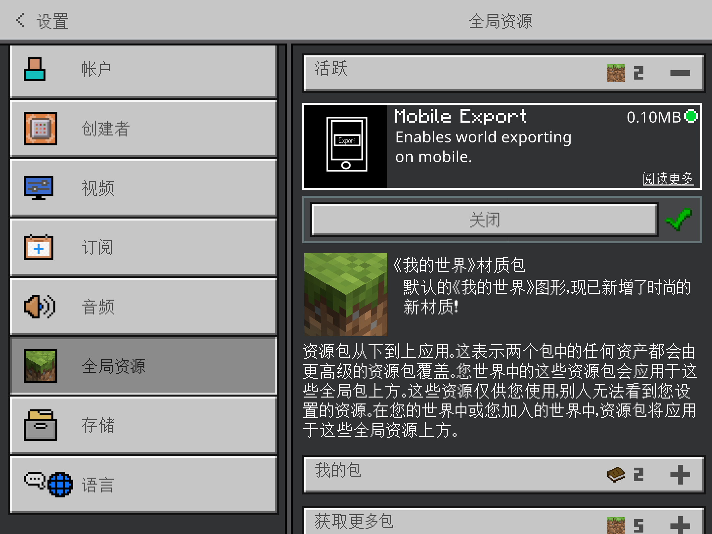

本篇wiki将会教你如何往基岩版服务端导入存档。

-----

## 从客户端导出

### Android导出教程
由于谷歌对App做出了限制，在BE1.18后，"外部存储"的存储目录被移动至`Android/data/com.mojang.minecraftpe/files/games/com.mojang/minecraftWorlds/`下。   
如果是您本地创建的存档，其文件夹名称将会是一串无规则`英文字符or数字+等号(=)`，如下图所示。  
请打开文件夹内的`levelname.txt`查看存档名，确保你选择的是需要导出的存档。


回到`minecraftWorlds`文件夹，选择对应的存档文件夹，压缩成zip格式，如下图所示：


:::warning 警告

在Android11及更高的版本中，由于谷歌的限制，您需要将存档文件夹复制到非`Android/data`的目录下进行压缩！

:::

或者也可以选择不压缩，使用[SFTP工具](/docs/sfe4/30-sftp.md)直接上传整个文件夹。

### Windows导出教程

*是三个教程里最简单的一个端*

在游戏内点击此处铅笔（绿色高亮显示）


在存档详情页拉到最下方，如下图



直接点击“导出世界”并导出即可


### iOS导出教程

与安卓端导出教程基本相同。打开“文件”，在我的iPhone/iPad里找到`Minecraft`，进入以下目录：`/Minecraft/games/com.mojang/minecraftWorlds`后根据文件夹内的`levelname.txt`寻找需要导出的存档并将整个乱码文件夹压缩为zip即可。



### 移动端：使用资源包快捷导出

下载“存档导出mod”的资源包，打开方式选择“Minecraft”来导入。

这个包在综合交流群10的群文件里存了一份，Simpbbs上也有[帖子](https://www.simpbbs.com/resources/mod.9/)（←点击即可快捷到达！）



在游戏内全局资源里启用该资源包，或者给你想导出的存档单独装上。



然后你的游戏就像电脑端一样可以直接导出存档了！


### 下载的存档

你已经有存档了，请直接快进下一步。

## 导入存档到SFE4服务器

### 第零步

在往文件管理里扔存档之前，你应该先检查一下存档文件结构是否正确。

基岩版存档内有最少7项、最多（我见过的最多）12项文件/文件夹，只有符合这个格式的存档能被游戏识别（所有端都一样）。如下表（斜体表示不必须）

| 文件或文件夹 | 说明 |
| :--- | :--- |
| db | 存储存档数据 |
| behavior_packs | 存放行为包 |
| resource_packs | 存放资源包 |
| *texts* | *特殊文本，在存档切换过语言的情况下出现，存放不同语言下不变的文本* |
| levelname.txt | 存放存档名 |
| world_icon.jpeg | 存档图标 |
| level.dat | 存放地图数据 |
| level.dat_old | level.dat的备份 |
| *world_behavior_packs.json* | *记录启用的行为包* |
| *world_behavior_packs_history.json* | *记录所有启用过的行为包* |
| *world_resource_packs.json* | *记录启用的资源包* |
| *world_resource_packs_history.json* | *记录所有启用过的资源包* |

*虽然一般不会有错，但是看看为好，以免套了个文件夹。*

### 第一步

打开SFE4控制台，选择实例，转到文件页面，并转到`/worlds/`文件夹，如下图所示：


### 第二步

上传存档（或存档压缩包），如果上传的是压缩包，在上传完毕后解压。
最终结果应如下图所示：
例：此处我上传的新存档文件夹名称为`Fontaine`。


### 第三步

回到服务器根目录，打开`server.properties`，找到下面这行配置：     
```
level-name=Bedrock level
# Allowed values: Any string without semicolon symbol or symbols illegal for file name: /\n\r\t\f`?*\\<>|\":
```
将其中的`Bedrock level`更改为你上传的存档文件夹的名字。  
例：在上一步中我上传的存档文件夹名为`Fontaine`，那么我就需要把`Bedrock level`更改为`Fontaine`，如下图所示：   

   

### 第四步

回到终端界面，开启服务器，查看存档是否正确导入。  

